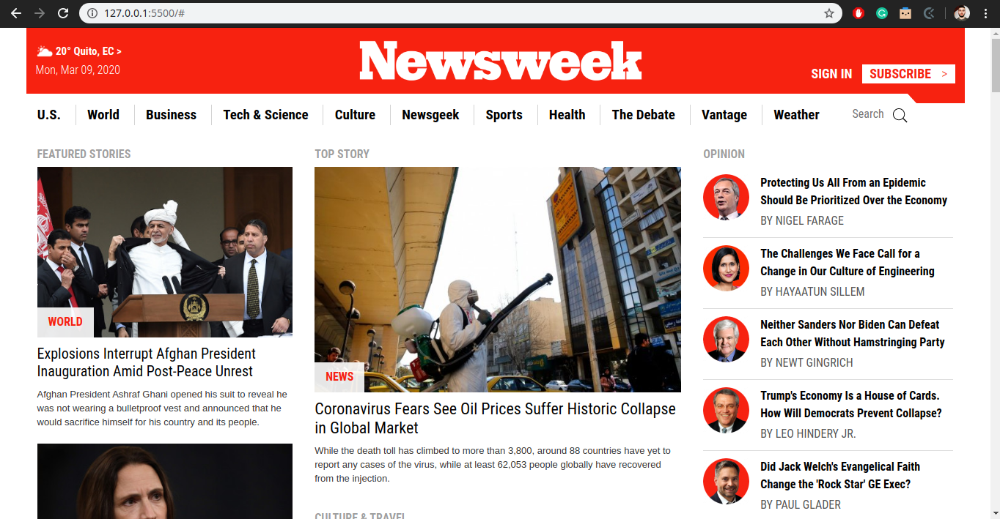

# Newsweek.com clone with Bootstrap

> This page is being cloned from the original using bootstrap where it is possible without affecting the styling from the original. Most of the styles in the style.css file are for custom colors and sizes.

- Original: [newsweek.com](https://www.newsweek.com/)

## Built With

- HTML5, CSS3
- Flexbox
- Bootstrap

## Live Demo

[Live Demo Link](https://rawcdn.githack.com/lBuggie/newsweek/e3056048ef59b0f7aa621cdabf0235fe2f16b7ca/index.html)

## Authors

👤 **Sebastian Gil Rodriguez**

- Github: [@lBuggie](https://github.com/sebGilR)
- Twitter: [@sebGilR](https://twitter.com/sebGilR)
- Linkedin: [linkedin](https://www.linkedin.com/in/sebastianGilRodriguez)

## 🤝 Contributing

Contributions, issues and feature requests are welcome!

Feel free to check the [issues page](issues/).

## Show your support

Give a ⭐️ if you like this project!

